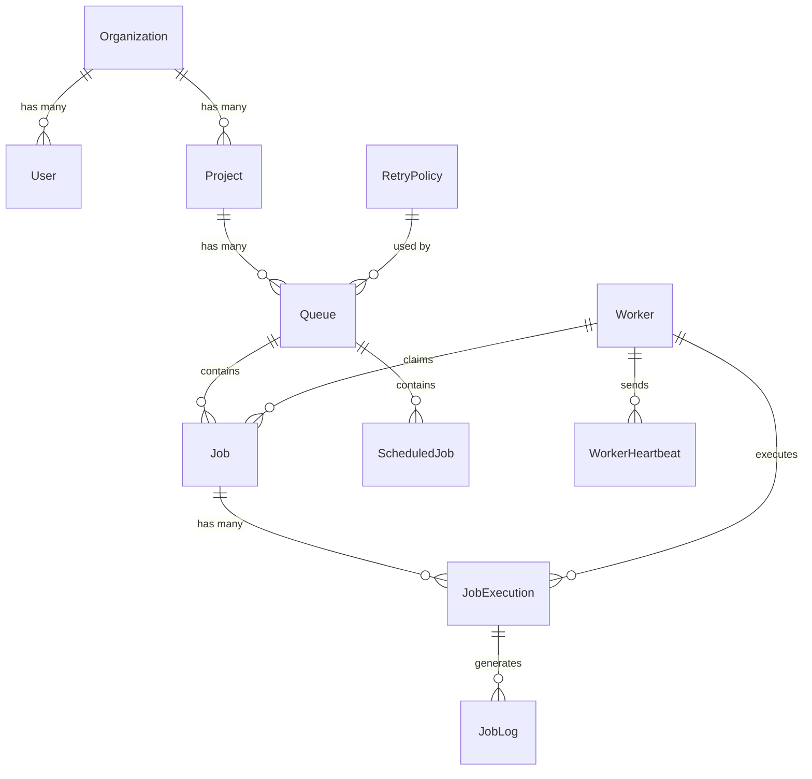

# Database Design Document

## 1. Entity List with Purpose
*   **Users**: Represents registered users who can manage projects.
*   **Organizations**: Groups users and owns projects for billing/tenant separation.
*   **Projects**: Represents a workspace containing multiple job queues.
*   **Queues**: Represents a distinct pipeline for processing jobs with specific concurrency and retry rules.
*   **Jobs**: Represents a unit of work that needs to be executed asynchronously.
*   **JobExecutions**: Tracks individual attempts to run a job (a job might have multiple executions if retried).
*   **RetryPolicies**: Defines the backoff strategy (fixed, linear, exponential) for failed jobs in a queue.
*   **Workers**: Represents a worker node/process capable of executing jobs.
*   **WorkerHeartbeats**: Tracks the active status and health of workers to detect crashes.
*   **JobLogs**: Stores the output, errors, and standard logs for a specific job execution.
*   **ScheduledJobs**: Separate entity to store recurrence logic (e.g. cron expressions) for jobs that spawn periodically.
*   **DeadLetterQueue**: Stores permanently failed jobs after all retry attempts are exhausted.

## 2. Schema Diagram


## 3. Per-Table Breakdown

### Organizations & Projects
*   **Primary Key**: UUID (Prevents ID enumeration, allows decentralized generation, and sets up a foundation for future cross-region sharding).
*   **Foreign Keys**: `Project.organization_id` (`ON DELETE CASCADE`). If an organization is removed, all its projects and nested queues/jobs should be deleted to clean up resources.
*   **Indexes**: Index on `organization_id` in Projects to optimize tenant lookups.
*   **Denormalization**: None. 3NF strictly followed for tenants.

### Users
*   **Primary Key**: UUID.
*   **Foreign Keys**: `organization_id` (`ON DELETE CASCADE`). 
*   **Indexes**: Unique index on `email` for quick authentication lookups.

### Queues & RetryPolicies
*   **Primary Key**: UUID.
*   **Foreign Keys**: `project_id` (`ON DELETE CASCADE`), `retry_policy_id` (`ON DELETE SET NULL`). We preserve queues even if a global retry policy is removed, falling back to default retry behavior.
*   **Indexes**: `project_id` for dashboard queries fetching all queues per project.

### Jobs
*   **Primary Key**: UUID (Critical for distributed systems where workers and clients may need to generate IDs concurrently without round-tripping to the DB).
*   **Foreign Keys**: 
    *   `queue_id` (`ON DELETE CASCADE`) — If a queue is deleted, we drop all its pending jobs.
    *   `claimed_by` referencing `Workers.id` (`ON DELETE SET NULL`) — If a worker is deregistered, the job claim becomes null, allowing it to be reaped.
*   **Indexes**: Composite index on `(queue_id, status, scheduled_at, priority DESC)`. This is the most important index in the entire system, explicitly designed to make the worker's polling query instantaneous.
*   **Denormalization**: We store `attempts` and `max_retries` directly on the `Job` rather than doing a `COUNT()` on `JobExecutions` every time, significantly speeding up the retry logic.

### JobExecutions & JobLogs
*   **Primary Key**: UUID.
*   **Foreign Keys**: 
    *   `job_id` (`ON DELETE CASCADE`)
    *   `worker_id` (`ON DELETE SET NULL`)
    *   `execution_id` (in JobLogs, `ON DELETE CASCADE`)
*   **Indexes**: `job_id` (to list execution history). 
*   **Denormalization**: We duplicate `queue_id` onto `JobExecution` for query convenience. This allows us to aggregate execution metrics (throughput, error rates) per queue without needing a complex `JOIN` against the `Job` table on very large datasets.

### Workers & WorkerHeartbeats
*   **Primary Key**: UUID.
*   **Foreign Keys**: `worker_id` (`ON DELETE CASCADE`).

### DeadLetterQueue
*   **Primary Key**: UUID.
*   **Foreign Keys**: None (Standalone records decoupled from cascading deletes, ensuring historical forensics remain intact even if the parent project or queue is deleted).
*   **Indexes**: `queue_id` for UI filtering.

## 4. Concurrency-Critical Section

To guarantee atomic job claiming without a separate lock manager like Redis, we leverage PostgreSQL row-level locks natively.

*   **Atomic Claiming SQL**:
    ```sql
    UPDATE jobs SET 
        status = 'claimed', 
        claimed_by = :worker_id, 
        updated_at = NOW()
    WHERE id = (
        SELECT id FROM jobs 
        WHERE queue_id = :queue_id 
          AND status = 'queued' 
          AND scheduled_at <= NOW()
        ORDER BY priority DESC, scheduled_at ASC
        FOR UPDATE SKIP LOCKED
        LIMIT 1
    )
    RETURNING *;
    ```
    The `FOR UPDATE SKIP LOCKED` clause is the linchpin. When a worker selects a row, it acquires a write lock. If a concurrent worker polls at the exact same millisecond, `SKIP LOCKED` instructs Postgres to immediately skip the locked row and grab the next available job, eliminating lock contention and completely preventing double-claiming.

*   **Isolation Level**: `READ COMMITTED` (Postgres default) is sufficient here because the `FOR UPDATE` lock forces concurrent transactions to evaluate the `WHERE` clause against the latest committed version of the row.

*   **Stale-Claim Detection**: Workers send heartbeats to `WorkerHeartbeats` every 10 seconds. A separate "Reaper" process polls the DB for jobs in `claimed` or `running` state where the associated worker hasn't sent a heartbeat in >30 seconds. The Reaper atomically resets these jobs back to `queued` (or routes them to the DLQ if they exceed max retries), preventing orphaned jobs from being stuck forever.

## 5. Normalization Discussion
The schema targets **3rd Normal Form (3NF)**. Every non-key attribute depends entirely on the primary key. 

*   **Deliberate Deviations**: As mentioned, `queue_id` is denormalized onto `JobExecution`. While this technically violates 3NF (since `queue_id` is transitively dependent on `job_id`), it is a deliberate decision for performance. Analyzing throughput per queue over millions of rows would require an expensive `JOIN` between `JobExecutions` and `Jobs`. Denormalizing it enables blazing-fast time-series queries directly on the `JobExecutions` table.

## 6. Scaling & Performance Considerations
*   **Partitioning**: The `JobLogs` and `JobExecutions` tables will grow unboundedly in a production system. They should be configured with **PostgreSQL Table Partitioning** (e.g., partitioned by `created_at` per month or week). This allows for efficient data retention policies (dropping old partitions instantly rather than expensive `DELETE` queries).
*   **Index Maintenance Tradeoffs**: The composite index on `Jobs (queue_id, status, scheduled_at, priority)` is heavy. Updates to `status` will cause index churn (HOT updates might mitigate this if the payload is out-of-line). In extreme scale, jobs should be soft-deleted or moved to a historic table upon completion to keep the active `Jobs` table index very small and fit entirely in RAM.

## 7. Sample Queries

**1. Claim Next Job (Worker Polling)**
```sql
-- Fast because of composite index: (queue_id, status, scheduled_at, priority)
UPDATE jobs SET status = 'claimed', claimed_by = 'w-123' 
WHERE id = (
    SELECT id FROM jobs WHERE queue_id = 'q-456' AND status = 'queued' AND scheduled_at <= NOW()
    ORDER BY priority DESC, scheduled_at ASC FOR UPDATE SKIP LOCKED LIMIT 1
) RETURNING *;
```

**2. Get Queue Stats (Dashboard)**
```sql
-- Fast because of index on queue_id
SELECT status, COUNT(*) as count FROM jobs 
WHERE queue_id = 'q-456' GROUP BY status;
```

**3. Reaper Detecting Stale Jobs**
```sql
-- Fast because of index on claimed_by and status
UPDATE jobs SET status = 'queued', claimed_by = NULL
WHERE status IN ('claimed', 'running') 
  AND claimed_by IN (
      SELECT id FROM workers WHERE last_heartbeat < NOW() - INTERVAL '30 seconds'
  );
```
