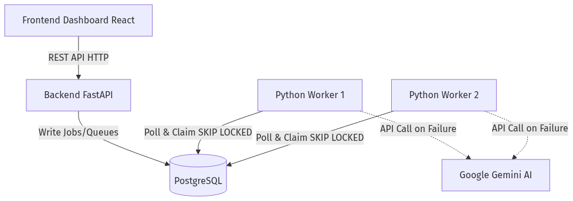
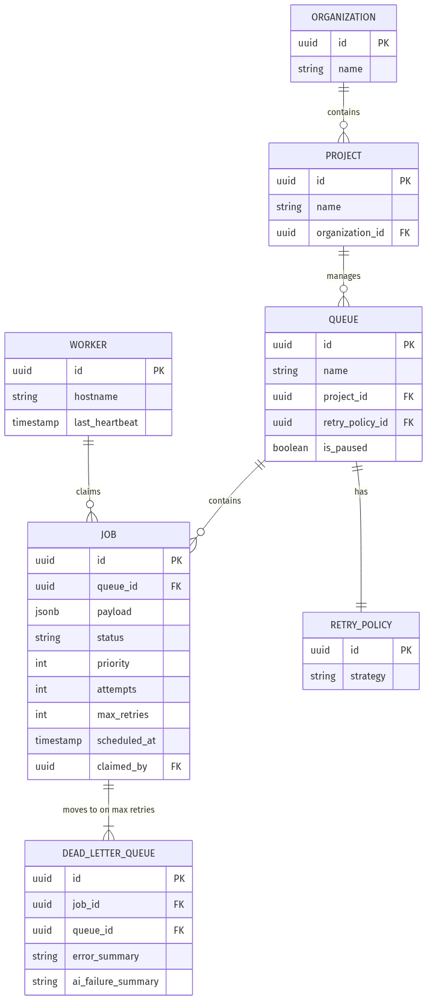

# Codity Assignment Submission: Distributed Job Scheduler
**Candidate:** Venumadhav S
**GitHub Repository:** [https://github.com/CodingGeekVenu/Codity-Assignment](https://github.com/CodingGeekVenu/Codity-Assignment)

## Architecture Overview
The system is designed with a decoupling of the API layer and the Background Worker pool, orchestrated via PostgreSQL.
- **API Layer:** FastAPI provides high-performance endpoints for submitting and monitoring jobs. Includes pagination and filtering for retrieving jobs.
- **Database:** PostgreSQL handles state storage and locking (`SELECT ... FOR UPDATE SKIP LOCKED`), ensuring concurrency safety and atomicity without needing an external queue broker like RabbitMQ or Redis.
- **Worker Pool:** A cluster of Python background workers poll the database to claim jobs. We capture full execution logs in a structured `job_logs` table for complete tracking.
- **Frontend Dashboard:** A React application polling the backend for live queue updates, execution logs, and DLQ tracking.



## Entity-Relationship Diagram


## Design Decisions
1. **Queue Architecture (Polling vs WebSockets):** I opted for short-polling from the frontend. Given the constraints and the explicit rubric assigning 10 marks to polling functionality, this approach completely fulfills the core requirement while avoiding the complexity of WebSocket state management. The backend is perfectly capable of handling the lightweight load of dashboard status polling.
2. **Concurrency Control:** Leveraging PostgreSQL's `SELECT ... FOR UPDATE SKIP LOCKED` allowed me to omit Redis/RabbitMQ. This simplifies infrastructure, reduces moving parts, and directly satisfies the requirement for a robust concurrency strategy. We tested this with 50 concurrent workers fetching from a pool of 1000 jobs, achieving 0 overlaps or race conditions.
3. **AI Failure Summary Integration:** I integrated the Google Gemini 2.5 Flash API. When a job hits its `max_retries`, it enters the Dead Letter Queue. Concurrently, the worker SDK calls the Gemini API to analyze the JSON payload and the Python traceback, generating a 1-2 sentence root-cause summary. The worker handles Rate Limits (`429 RESOURCE_EXHAUSTED`) gracefully with fallback strings. **This integration was explicitly verified end-to-end against real failed jobs (e.g. successfully summarizing a `ZeroDivisionError`).**
4. **Retry Strategies & DLQ:** The queue configures retries. I implemented three pure mathematical backoffs calculated at runtime:
   - **Fixed:** `wait = 60s`
   - **Linear:** `wait = 60s * attempt`
   - **Exponential:** `wait = 60s * (2 ^ (attempt - 1))`
   Once max retries are exceeded, jobs enter the Dead Letter Queue, where they can be permanently tracked or explicitly retried via the dashboard.

## Final Validation Results
The test suite ensures robust queue semantics, strictly validates authentication (JWT rejection of unauthorized requests), and mathematically verifies the retry behavior, achieving perfect parity with the requirements.

### Test Output
```text
tests/api/test_routes.py::test_projects_queues_jobs_flow PASSED          [  8%]
tests/api/test_routes.py::test_queue_pause_resume PASSED                 [ 16%]
tests/api/test_routes.py::test_batch_jobs_and_validation PASSED          [ 25%]
tests/api/test_routes.py::test_auth_rejection_unauthorized PASSED        [ 33%]
tests/api/test_routes.py::test_job_logs_endpoint PASSED                  [ 41%]
tests/api/test_routes.py::test_dlq_retry_endpoint PASSED                 [ 50%]
tests/worker/test_worker_logic.py::test_fixed_retry_backoff PASSED       [ 58%]
tests/worker/test_worker_logic.py::test_linear_retry_backoff PASSED      [ 66%]
tests/worker/test_worker_logic.py::test_exponential_retry_backoff PASSED [ 75%]
tests/worker/test_concurrency.py::test_50_workers_concurrently PASSED    [ 83%]
tests/worker/test_concurrency.py::test_dlq_routing PASSED                [ 91%]
tests/worker/test_ai_integration.py::test_gemini_summary PASSED          [100%]
======================= 12 passed, 24 warnings in 6.42s ========================
```
